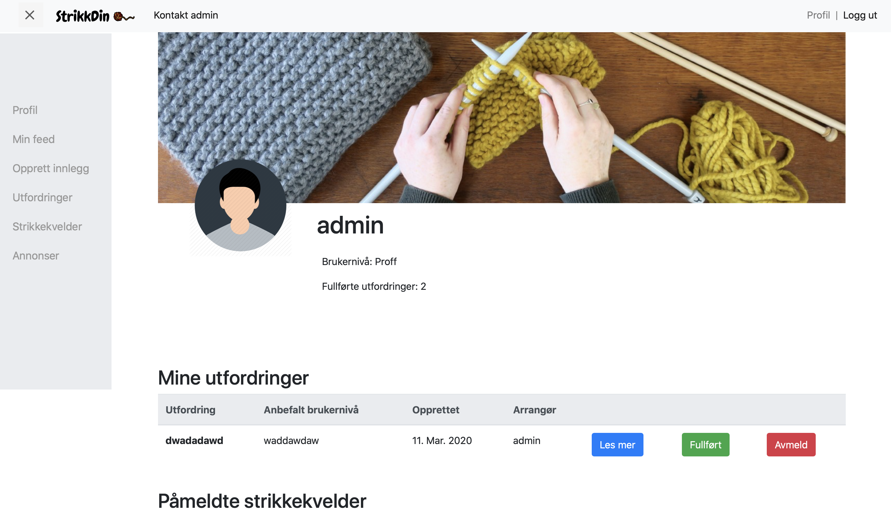

# 

This is a group project for the course TDT4145 Programvareutvikling.
The goal of this project is to immerse in Agile Methodology, and develop crucial skills in cooperation, project planning and source-code management. This includes learning
to use Git and using Git-repository manager GitLab.

Our job is to create a knit platform for our product owner. This platform is a knitting network where
knitters and corporates can meet. This web application will allow users to create arrangements, challenges,
advertisement and share thoughts through a common feed. Knitters will be able to participate in challenges and arrangements
created by companies.


## Features
* Cross-platform
* User authentication
* Admin management platform

## Demo

An example of the application:



When logged in you will have access to a variety of functionalities.

## How to use

For a detailed guide on how to use the application, refer to our Wiki page:

[User Manual](https://gitlab.stud.idi.ntnu.no/tdt4140-2020/13/-/wikis/Wiki-1:-Brukermanual)

## Technology/framework
#### Built with:
* [Django](https://www.djangoproject.com) - Python framework
* [Bootstrap](https://getbootstrap.com) - CSS framework
* [SQLite](https://www.sqlite.org/index.html) - Database

#### Dependencies:
* [django-widget-tweaks](https://pypi.org/project/django-widget-tweaks/)

## Requirements

To run the project, you must have Python 3.8 or later and Pip installed.

## Installation

We recommend to use a virtual environment like [VirtualEnv](https://virtualenv.pypa.io/en/latest/installation.html) to isolate Python projects. This may help to prevent problems in the future.

To activate VirtualEnv:

```sh
$ source /venv/bin/activate
```


### Clone and run project


1. Use any IDE that supports Python and clone: 

    ```
    https://gitlab.stud.idi.ntnu.no/tdt4140-2020/13.git
    ```

    Or use Git to clone:

    ```sh
     $ git clone https://gitlab.stud.idi.ntnu.no/tdt4140-2020/13.git
    ```

2. Install required packages:

    ```sh
     $ pip install -r requirements.txt
    ```

3. Apply migrations:

    ```sh
     $ python manage.py migrate
    ```

   > You may have to change directory to PU13 before using the command over:
   > This can be done by running: `$ cd PU13`
   
4. Run project:

    ```sh
     $ python manage.py runserver
    ```
    
    Use a web browser and visit your development server: `http://127.0.0.1:8000/`

## Tests

Tests in Django are written using the unittest module which is built-in to the Python standard library.

The project is integrated with CI to validate and test code after every push and merge. 
This will make it easy to catch bugs and errors in the development cycle, ensuring that all the code deployed to production is working correctly.
It is possible to check the status and rerun the pipeline under *GitLab --> CI/CD --> Pipelines*

The tests can also be ran with the command:

```sh
 $ python manage.py test
```

## Team Members
* Andreas Torgersen
* Elise Almestad
* Mai Tran
* Vivi Svendsen
* William H. Le
* Anders Lyholm Limi

## License
NTNU © PU13
